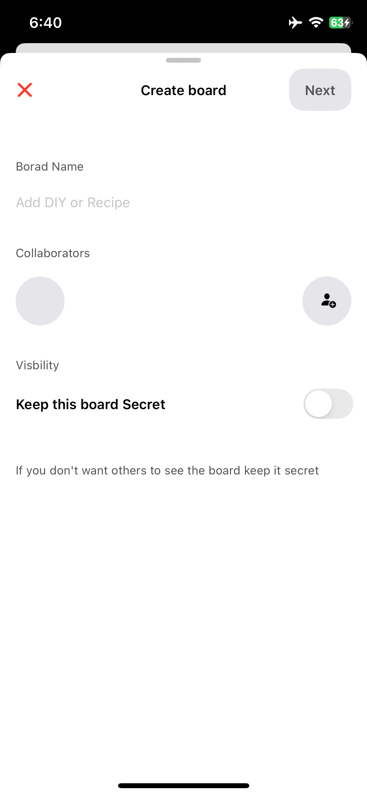
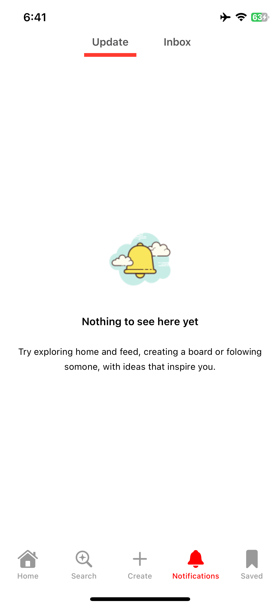
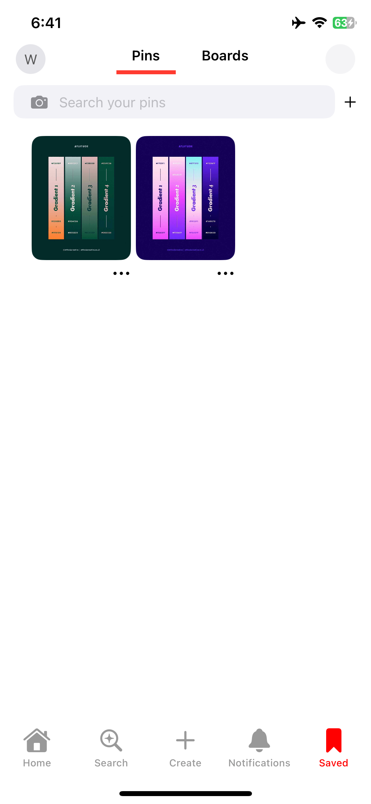

# Pinterest UI Replica (SwiftUI + Firebase)

A beautiful Pinterest-style UI replica built using **SwiftUI**, **Firebase**, **Firestore**, **Kingfisher**, and **Cloudinary**. This app mimics Pinterest's core layout and functionality, including image browsing, uploading, and user authentication.

---

## Features

- Firebase Authentication (Email & Password)
- Pinterest-like staggered grid view
- Cloudinary for image uploads
- Kingfisher for image downloading and caching
- Profile and settings screen
- Clean SwiftUI navigation using MVVM pattern

---

## Tech Stack

- **SwiftUI** – Modern declarative UI framework
- **Firebase** – Auth and Firestore for backend
- **Firestore** – Real-time cloud database
- **Cloudinary** – Cloud media management and CDN
- **Kingfisher** – Swift image downloader and cache
- **MVVM Architecture** – Clean, testable code structure

---

## Screenshots








---

## Getting Started

1. **Clone the repository:**

```bash
git clone https://github.com/your-username/pinterest-ui-replica.git
cd pinterest-ui-replica
